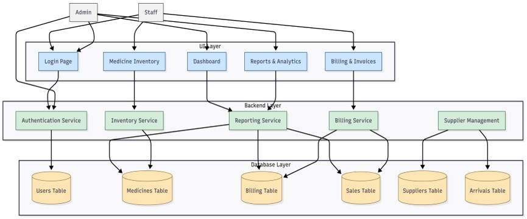
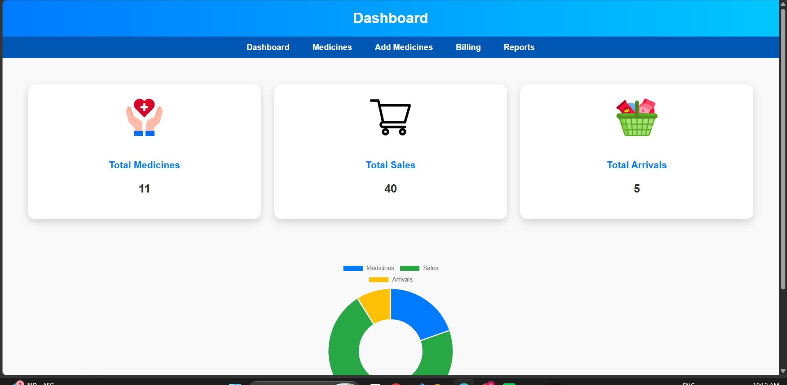
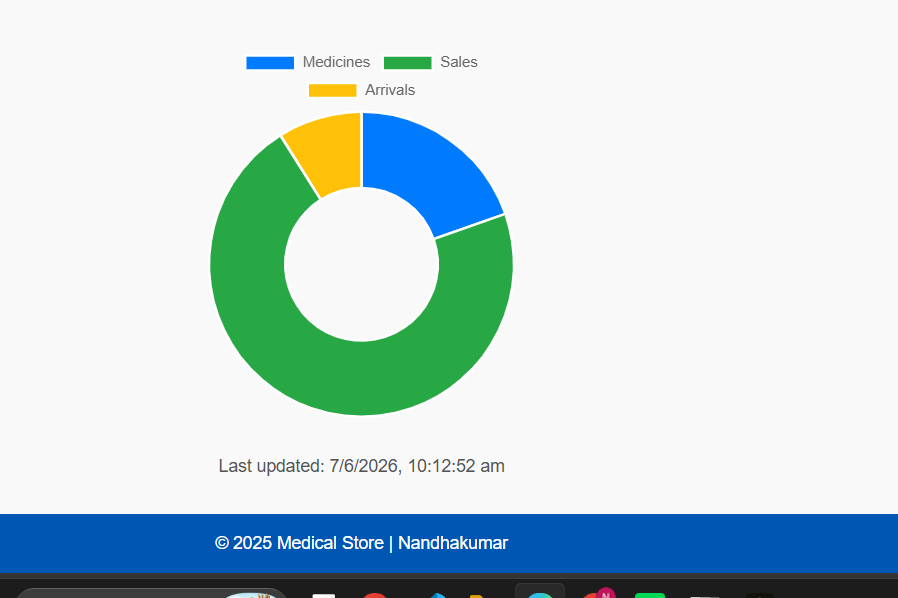
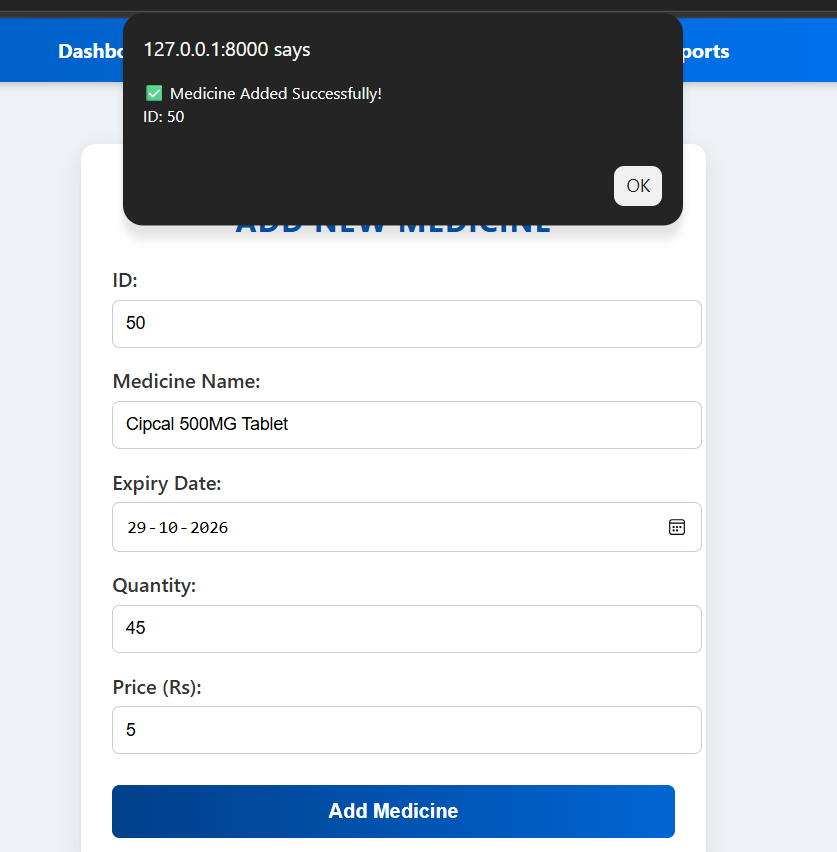
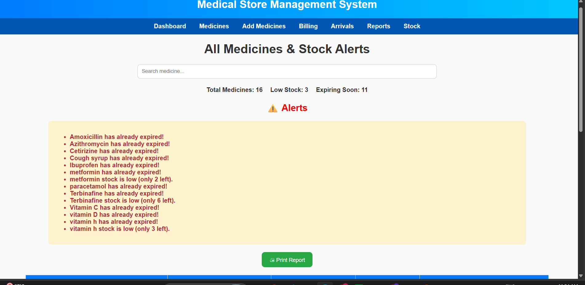
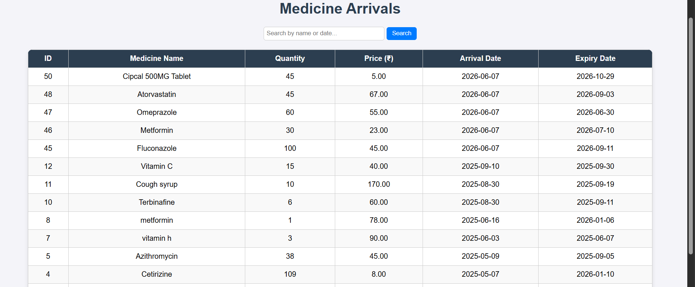
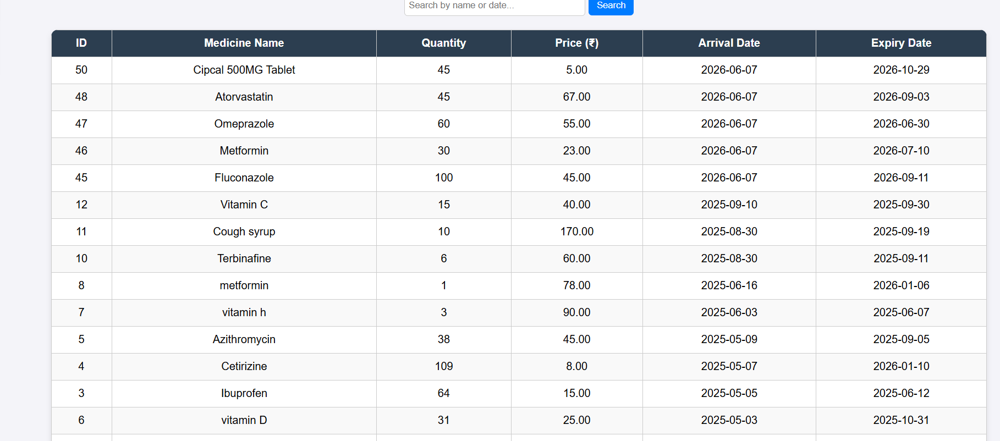
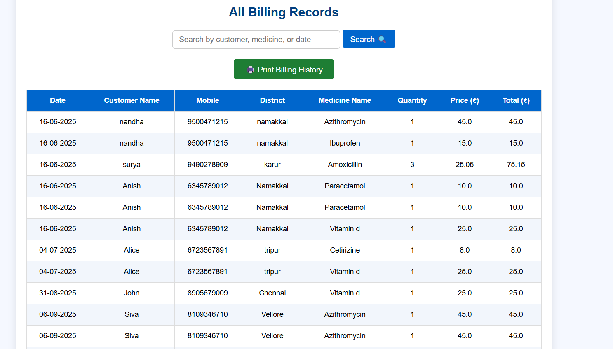
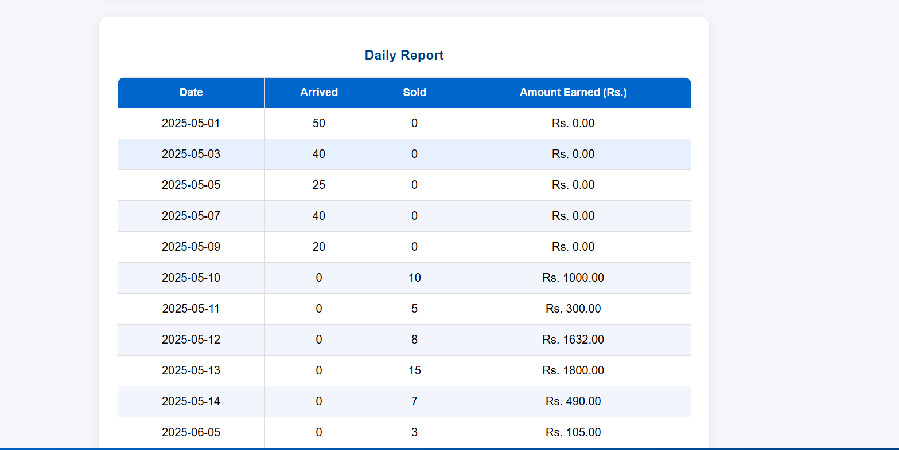
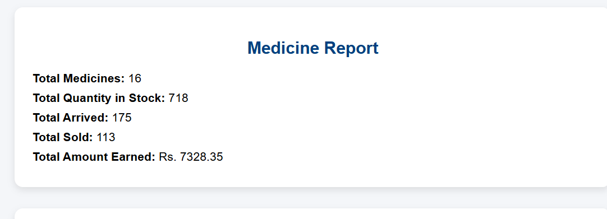

# 🏥 Medical Store Management Application

A comprehensive **Medical Store Management System** developed using **FastAPI, PostgreSQL, HTML, CSS, JavaScript, and Jinja2 Templates**. The application streamlines the daily operations of a medical store by managing medicine inventory, customer billing, stock arrivals, sales records, and business reports through a centralized platform.

---

## 📖 Table of Contents

- Project Overview
- System Architecture
- Project Structure
- Features
- Technologies Used
- Modules
- Database Design
- Screenshots
- Installation & Setup
- Future Enhancements
- Project Report
- Developer

---

# 📌 Project Overview

Medical stores handle large volumes of medicines, customer transactions, stock updates, and sales records every day. Manual management often leads to errors, inventory mismatches, and inefficient reporting.

The **Medical Store Management Application** provides an automated solution for:

- Medicine Inventory Management
- Customer Billing
- Stock Arrival Tracking
- Sales Monitoring
- Report Generation
- Expiry Date Monitoring
- Low Stock Alerts
- Secure User Authentication

The system improves accuracy, reduces manual work, and enables efficient store management.

---

# 🏗️ System Architecture



### Architecture Layers

### 1️⃣ Presentation Layer

Responsible for user interaction.

**Technologies Used:**

- HTML
- CSS
- JavaScript
- Jinja2 Templates

### 2️⃣ Application Layer

Handles business logic and request processing.

**Technologies Used:**

- FastAPI
- Python
- Session Management

### 3️⃣ Data Layer

Stores application data.

**Technologies Used:**

- PostgreSQL
- SQLite (Backup)

---

# 📂 Project Structure

```text
MedicalStore_Management_Application/
│
├── project/
│   ├── main.py
│   ├── requirements.txt
│   └── store.db
│
├── templates/
│   ├── login.html
│   ├── dashboard.html
│   ├── medicines.html
│   ├── add_medicine.html
│   ├── billing.html
│   ├── billing_details.html
│   ├── billing_history.html
│   ├── medicine_arrivals.html
│   ├── report.html
│   └── sales.html
│
├── static/
│   ├── logo.jpg
│   ├── med.jpg
│   └── med1.jpg
│
├── Images/
│   ├── Front page.png
│   ├── Dashboard.png
│   ├── Dashboard_piechart.png
│   ├── Add_medicine.png
│   ├── Medicine_details1.png
│   ├── Medicine_details2.png
│   ├── Medicine_arrival.png
│   ├── Medicine_arrival2.png
│   ├── Bill form.png
│   ├── Add bill.png
│   ├── Customer_bill1.png
│   ├── Billing_records.png
│   ├── Daily_report.png
│   └── Store_report.png
│
├── Architecture.jpg
├── Report_102.pdf
└── README.md
```

---

# ✨ Features

## 🔐 Authentication Module

- Secure login system
- Session-based authentication
- User validation
- Protected routes

---

## 📊 Dashboard Module

The dashboard provides an overview of store activities.

### Features

- Total Medicines Count
- Sales Statistics
- Arrival Statistics
- Low Stock Alerts
- Expiry Alerts
- Chart-Based Visualization

---

## 💊 Medicine Inventory Management

The inventory module helps manage medicines effectively.

### Features

- Add New Medicines
- Update Medicine Information
- Track Medicine Quantities
- Monitor Expiry Dates
- Search Medicines

---

## 🚚 Medicine Arrival Management

Tracks incoming medicine stock.

### Features

- Record Medicine Arrivals
- Monitor Arrival Quantities
- Arrival History Tracking
- Date-Based Records

---

## 🧾 Billing System

A dynamic billing system for customer purchases.

### Features

- Customer Information Entry
- Medicine Selection
- Automatic Price Calculation
- Invoice Generation
- Inventory Deduction
- Sales Tracking

---

## 📑 Billing History

Stores billing records for future reference.

### Features

- Search Previous Bills
- Customer-Based Search
- Date-Based Search
- Medicine-Based Search

---

## 📈 Reports & Analytics

Provides business insights and sales analytics.

### Features

- Daily Sales Reports
- Revenue Tracking
- Inventory Reports
- Store Performance Analytics

---

# ⚙️ Technologies Used

| Technology | Purpose |
|------------|----------|
| FastAPI | Backend Framework |
| PostgreSQL | Primary Database |
| SQLite | Backup Database |
| Python | Backend Programming |
| HTML | Frontend Structure |
| CSS | User Interface Styling |
| JavaScript | Dynamic Functionality |
| Jinja2 | Template Rendering |
| psycopg2 | PostgreSQL Connectivity |
| Chart.js | Dashboard Visualization |
| itsdangerous | Session Security |

---

# 🗄️ Database Design

The application uses PostgreSQL as its primary database.

---

## Users Table

Stores authentication information.

| Field | Description |
|---------|-------------|
| id | User ID |
| username | Username |
| password | Password |
| role | User Role |

---

## Medicines Table

Stores medicine inventory information.

| Field | Description |
|---------|-------------|
| med_id | Medicine ID |
| name | Medicine Name |
| quantity | Available Quantity |
| price | Unit Price |
| expiry_date | Expiry Date |

---

## Sales Table

Stores sales information.

| Field | Description |
|---------|-------------|
| sale_id | Sale ID |
| medicine_id | Medicine Reference |
| quantity | Quantity Sold |
| amount | Total Amount |

---

## Arrivals Table

Stores incoming medicine stock.

| Field | Description |
|---------|-------------|
| arrival_id | Arrival ID |
| medicine_id | Medicine Reference |
| quantity | Arrived Quantity |
| date | Arrival Date |

---

## Bills Table

Stores billing details.

| Field | Description |
|---------|-------------|
| bill_id | Bill ID |
| customer_name | Customer Name |
| mobile | Mobile Number |
| total_amount | Total Bill Amount |

---

# 📸 Application Screenshots

## 🔐 Login Page


---

## 📊 Dashboard

### Dashboard Overview



### Dashboard Analytics



---

## 💊 Add Medicine



---

## 💊 Medicine Details

### Medicine Details - 1



### Medicine Details - 2


---

## 🚚 Medicine Arrival

### Arrival Records



### Arrival Details



---

## 🧾 Billing System

### Billing Form


### Add Bill


### Customer Bill


---

## 📑 Billing Records



---

## 📈 Reports

### Daily Report



### Store Report



---

# 🔄 Application Workflow

1. User logs into the system.
2. Dashboard displays current statistics.
3. Medicines are added and managed.
4. New stock arrivals are recorded.
5. Customer bills are generated.
6. Inventory updates automatically after billing.
7. Sales records are stored.
8. Reports and analytics are generated.

---

# 🚀 Installation & Setup

## Step 1: Clone Repository

```bash
git clone https://github.com/Nandhakumar1123/MedicalStore_Management_Application.git
```

## Step 2: Navigate to Project

```bash
cd MedicalStore_Management_Application
```

## Step 3: Create Virtual Environment

```bash
python -m venv venv
```

## Step 4: Activate Virtual Environment

### Windows

```bash
venv\Scripts\activate
```

### Linux/macOS

```bash
source venv/bin/activate
```

## Step 5: Install Dependencies

```bash
pip install -r project/requirements.txt
```

## Step 6: Configure PostgreSQL

Update database credentials in:

```text
project/main.py
```

Create required PostgreSQL tables.

---

## Step 7: Run Application

```bash
uvicorn project.main:app --reload
```

Open:

```text
http://127.0.0.1:8000
```

---

# 📄 Project Report

Detailed project documentation is available in:

```text
Report_102.pdf
```

---

# 🔮 Future Enhancements

- Barcode Scanner Integration
- Supplier Management System
- Email Notifications
- GST Invoice Generation
- Cloud Deployment
- Multi-Store Management
- AI-Based Inventory Prediction
- Mobile Application Support

---

# 🎯 Learning Outcomes

Through this project, the following concepts were implemented:

- FastAPI Development
- PostgreSQL Database Integration
- Session Management
- CRUD Operations
- Dynamic Billing Systems
- Inventory Management
- Dashboard Analytics
- Report Generation
- Frontend-Backend Integration

---

# 👨‍💻 Developer

## Nandhakumar D

**Medical Store Management Application**

Developed using:

- FastAPI
- PostgreSQL
- HTML
- CSS
- JavaScript
- Jinja2 Templates

---

## ⭐ Support

If you found this project useful, please consider giving it a **Star ⭐** on GitHub.

Thank you for visiting this repository!
